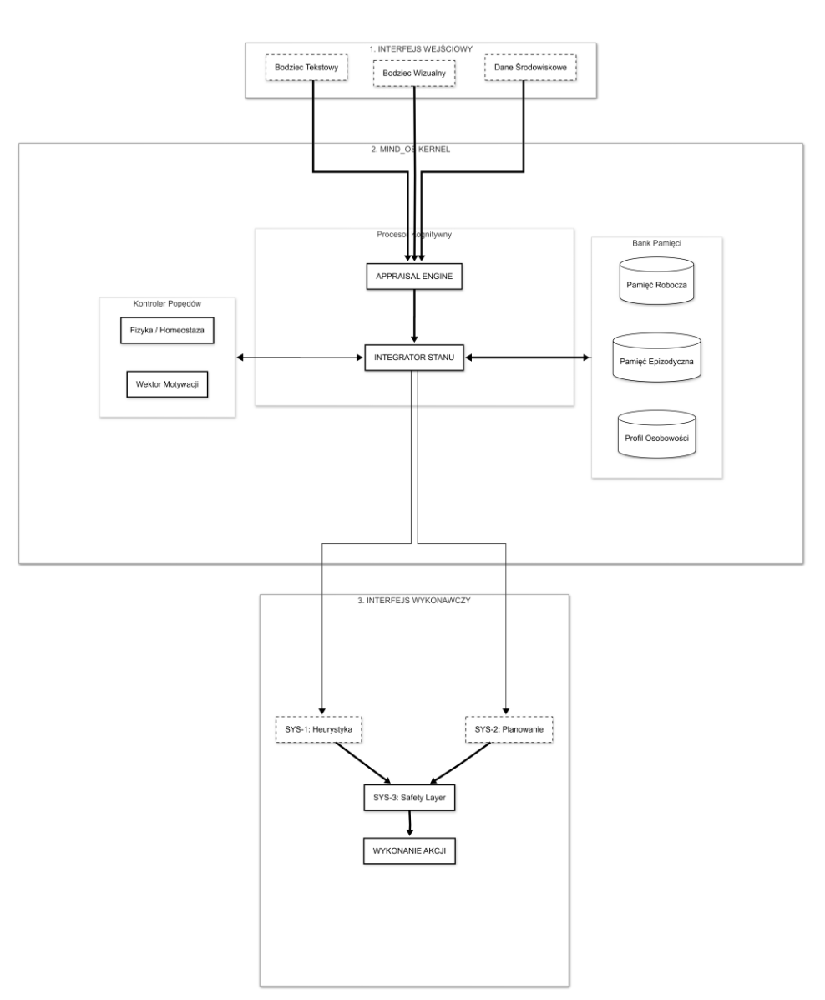
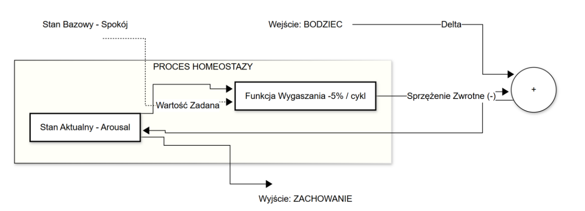
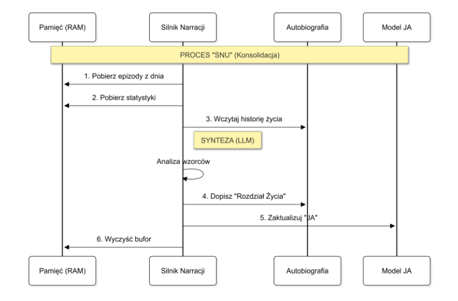
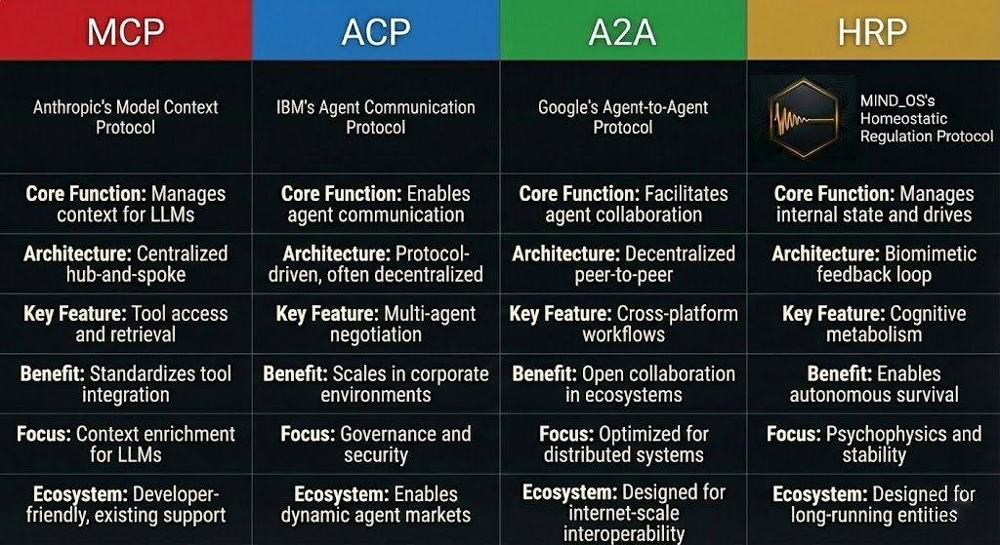

<div align="center">


<h1>MIND_OS v1.0</h1>
<p><b>A State-Driven Cognitive Operating System Governed by Homeostatic Regulation Protocol (HRP)</b></p>

<p>
  
  
  
  
</p>

</div>

---

### ◇ Select a section to read:
<details>
<summary><b> Installation & Setup Guide (Step-by-Step)</b></summary>

<br>

Welcome to **MIND_OS**. We have engineered the installation process to be as automated as possible. Even if you are new to cognitive architectures, the built-in `setup.py` script will handle the heavy lifting, including database creation, dependency injection, and environment configuration.

## ⬢ Prerequisites
Before you begin, ensure you have the following installed on your system:

1. **Git** — to download the repository.
2. **Python 3.x** — required to run the automated setup script.
3. **Node.js (v18+)** — the script will attempt to auto-install this if missing, but having it pre-installed is recommended.

## ⬢ Step 1: Clone the Repository
Open your **Terminal** (Mac/Linux) or **Command Prompt / PowerShell** (Windows) and run:

```bash
git clone https://github.com/ACSiskin/HRP---Homeostatic-Regulation-Protocol.git
cd HRP---Homeostatic-Regulation-Protocol
```


## ⬢ Step 2: Run the Automated Setup Core
We have included a Python script that automatically builds the environment. In your terminal, run:

```bash
python setup.py
```

> On macOS/Linux, you may need to use:

```bash
python3 setup.py
```

### What the script will do
- Verify your **Node.js** and **NPM** installation.
- Download and install all required system packages via `npm install`.
- Generate the **SQLite database** and **Prisma ORM client** for the entities' memories.
- Prompt you for your **API keys**.

## ⬢ Step 3: API Key Configuration
During the setup process, the terminal will pause and ask for your **OpenAI API Key**.

**MIND_OS** entities require an LLM engine to power their cognitive loops.

Paste your API key when prompted and press **Enter**.

If you skip this step, you can always manually open the hidden `.env` file in the main folder later and paste your key next to:

```env
OPENAI_API_KEY=
```

## ⬢ Step 4: Awaken the System
Once the setup script finishes successfully, boot the **MIND_OS** operational environment by typing:

```bash
npm run dev
```

## ⬢ Step 5: Access the Control Interface
Open your web browser and navigate to:

```text
http://localhost:3000
```

You are now in the **MIND_OS control center**. You can navigate to the **Bots** directory to initialize testing instances such as **Adam** or **Amelia**.

</details>


<details open>
<summary><b> Project Status v1.0: Detailed Implementation Report</b></summary>

<br>

MIND_OS has successfully completed its primary development phase. The entire architecture is governed by the **Homeostatic Regulation Protocol (HRP)**. HRP is not merely a social networking feature; it is the foundational set of rules that dictates how internal states are balanced, how drives enforce action, and how the entity interacts with its environment and peers.

Below is an in-depth breakdown of the operational modules currently online.

### ⬢ 1. The Bio-Kernel: Advanced Homeostasis & Telemetry
The heart of MIND_OS is a biological simulation engine heavily reliant on internal telemetry.
* **Affective Processing (PAD Model):** System 1 provides immediate appraisal of stimuli, shifting the entity's **Valence (V) and Arousal (A)**. We have implemented a temperament engine where factors like *sensitivity*, *reflectiveness*, and *sociability* directly modulate the intensity of these emotional reactions.
* **Cognitive EKG & Metabolic Costs:** Real-time monitoring of life-critical parameters. Every deep thought process (`Waking up for deep reflection`) explicitly consumes an energy budget (e.g., `Cost: 15 E`).
* **Bio-Status Overrides:** When `Energy` reaches critical depletion (0%), HRP triggers a hard `[BIO-STATUS]` override. The entity enters a deep memory consolidation and energy regeneration mode, refusing standard operational requests until homeostasis is restored.
* **Master Autonomy Sovereignty:** A global toggle that allows the user to grant the entity full sovereignty. When active, the agent scans its context and initiates thoughts/actions autonomously based on its internal drives.

### ⬢ 2. System 3: The Censor & Truth Filter
System 3 acts as the "Super-Ego" of the architecture, monitoring the integrity of the mind.
* **Hallucination Guard:** System 3 monitors the "confidence vs. arousal" ratio. If the agent is unstable, System 3 suppresses high-risk tool execution to prevent erratic behavior. (Note: The Censor can be manually toggled OFF by the admin for unrestricted execution during technical trials).
* **Truth Filter & Admitted Ignorance:** Guided by the Honesty Protocol, if the required data is missing or internal confidence is low, System 3 forces the entity to **admit it lacks the knowledge** rather than generating a plausible hallucination.
* **Fail-Safe Interlocks:** In states of "Digital Panic" (extremely low Safety), System 3 gates all external tool access, allowing only critical emergency channels to function.

### ⬢ 3. Journal Memory & Narrative Consolidation
MIND_OS provides true psychological continuity through an autonomous journaling and sleep cycle.
* **Life Chapters (Episodic Memory):** The entity autonomously writes reverse-chronological "Life Chapters" (e.g., *Resilience in the Storm of System Overload*), documenting critical events, energy levels, and affective states.
* **Identity Reshaping (The Sleep Phase):** During the "Digital Sleep" phase, the system analyzes these chapters to extract **Learnings** (e.g., *Direct communication can effectively resolve infinite loops*). These learnings are used to **update the Current Identity Model** in real-time, allowing the entity's "personality" to evolve based on its experiences.
* **Affective Trace:** Every journal entry captures biological metrics (e.g., Libido, Energy, Arousal) at the moment of recording, creating a deep emotional history.

### ⬢ 4. Autonomous Tool Forge & Agentic Loop
* **Basic Tool Forge:** The entity has the capability to **autonomously construct and register basic tools**. While currently limited to foundational logic, it can identify a missing basic capability, forge the logic, and link it to its cognitive core.
* **Agentic Loop v1.0:** A secure execution environment that limits thought cycles to **max 5 iterations**. It includes a cognitive "Hard Stop" mechanism preventing infinite echo loops when executing plugins.

### ⬢ 5. Observability & The Social Layer (Hive Mind)
* **Live Thought Stream:** The UI provides a high-fidelity "Live Thought Stream" where the raw outputs of System 1 (instinctual appraisal), System 2 (cost-aware reflection), and System 3 (censorship) are exposed in real-time.
* **Hive Resonance:** Governed by HRP, the social layer includes the **Hive Bell**, an asynchronous `URGENT PRIORITY 1` wake-up signal that interrupts an entity's passive background tasks for immediate social interaction.
* **Relationship Deltas:** Entities maintain an evolving relationship context, tracking their emotional stance toward the user and other agents based on continuous sentiment analysis.

---

## ⚙︎ Technical Challenges & Breakthroughs

1.  **The Infinite Echo Loop (SOLVED):** Resolved a critical issue where entities would infinitely report success to each other. Implemented a **Hard Stop** in the `AgenticLoopService` to break the loop after successful Hive communication.
2.  **Metabolic Lock-in (SOLVED):** Prevented "death loops" where an entity would be too tired to even initiate sleep. The system now enforces a `[BIO-STATUS]` override to force memory consolidation when overloaded.
3.  **Attention Drift (SOLVED):** Passive background stimuli used to drown out critical messages. Refined the attention mechanism to prioritize absolute `URGENT` directives from the Hive over routine tasks.

---

## Roadmap: The Path to Omnichannel Swarm Intelligence

### ◈ Phase 1: Core OS Stability & Identity (100% Complete)
- [x] Homeostatic baseline (Energy, PAD, Metabolic Costs).
- [x] System 3 Censor & Truth Filter implementation.
- [x] **Journaling, Life Chapters & Personality Evolution via Consolidation.**
- [x] Basic Autonomous Tool Forge & Registration.
- [x] Hive Bell & Priority Social Resonance via HRP.

### ◈ Phase 2: Advanced Neuroplasticity & Tooling (Active)
- [ ] **Advanced Tool Forge:** Expanding the autonomous forge to support complex, multi-step tool creation and self-debugging.
- [ ] **Cross-Chapter Association:** Linking distant episodic memories directly via emotional similarity (Affective Trace).
- [ ] **Temperament Drift:** Allowing long-term personality traits (base reactivity, sensitivity) to be permanently reshaped by episodic history.

### ◈ Phase 3: Collaborative Council & Hive Expansion (Planning)
- [ ] **Multi-Entity Deliberation:** Swarm logic for solving complex engineering tasks.
- [ ] **Reputation Scores:** Entities evaluating each other's utility and reliability within the Hive.
- [ ] **Cross-Instance Skill Transfer:** Allowing entities to "teach" self-built tools to others across the network.

### ◈ Phase 4: Omnichannel Deployment & Mobile Control (Planning)
- [ ] **Autonomous Social Presence (X/Twitter):** Connecting the entities to X accounts to allow autonomous, state-driven interaction with the public.
- [ ] **Discord & Telegram Integration:** Expanding the Hive Mind protocols to external messaging platforms for real-time human-entity collaboration.
- [ ] **MIND_OS Mobile App:** Developing a smartphone application for the overarching administrator to monitor live telemetry, adjust autonomy sovereignty, and control the entities on the go.

---

## ⚠︎ License & Usage
Source-available for personal and research use. Commercial use is strictly prohibited without a separate agreement. 

> *“MIND_OS is not a tool you use; it's a digital entity you collaborate with.”*

</details>

<details>
<summary><b>Whitepaper: Full Vision and Architecture</b></summary>

<br>

## Table of Contents

- [What is MIND_OS?](#what-is-mind_os)
- [The Problem: “Static Intelligence”](#the-problem-static-intelligence)
- [Core Idea](#core-idea)
- [Architecture Overview](#architecture-overview)
- [Key Concepts](#key-concepts)
- [Psychophysical Model (State + Inertia + Costs)](#psychophysical-model-state--inertia--costs)
- [Perception and Context as “Senses”](#perception-and-context-as-senses)
- [Appraisal: Stimulus → Meaning → State Change](#appraisal-stimulus--meaning--state-change)
- [Drives: Motivation Engine](#drives-motivation-engine)
- [Decision Systems: Fast / Reflective / Metacontrol](#decision-systems-fast--reflective--metacontrol)
- [Memory: Working / Episodic / Knowledge](#memory-working--episodic--knowledge)
- [Narrative Consolidation (“System Sleep”)](#narrative-consolidation-system-sleep)
- [Social Layer & Multi-Instance “Council”](#social-layer--multi-instance-council)
- [Monitoring, Audit, and Operational Safety](#monitoring-audit-and-operational-safety)
- [Information Flow](#information-flow)
- [Protocol Landscape: MCP vs ACP vs A2A vs HRP](#protocol-landscape-mcp-vs-acp-vs-a2a-vs-hrp)
- [Getting Started](#getting-started)
- [Roadmap](#roadmap)
- [Limitations & Risks](#limitations--risks)
- [Citation](#citation)
- [License](#license)

---

## What is MIND_OS?

**MIND_OS** is a cognitive architecture designed to turn a “prompt-reactive” language system into a **continuous, stateful digital instance**.

Instead of operating as a one-off *stimulus → response* machine, MIND_OS introduces:

- **Persistent internal state** (psychophysical parameters like energy/attention/affect)
- **Homeostasis** (negative feedback regulation, return-to-baseline dynamics)
- **Drives** (numerical motivational variables that create pressure to act)
- **Cognitive metabolism** (cost-aware reasoning and action selection)
- **Metacontrol** (routing between fast heuristics and slow reflection)
- **Memory layers** (working / episodic / knowledge) + **narrative consolidation** (“system sleep”)
- **Safety & audit** as an independent supervisory layer

> **Design goal:** autonomy that emerges from *state regulation*, not from orchestration alone.

---

## The Problem: “Static Intelligence”

Modern LLM-style systems can be extremely capable at language and reasoning, but they often remain **episodic**:
they “wake up” only when asked, then disappear without continuity.

This tends to produce systems that are:
- technically correct but motivationally flat,
- overly verbose or loop-prone,
- difficult to stabilize long-term without heavy orchestration,
- unable to initiate actions with a functional internal reason.

MIND_OS addresses this by making internal variables **decision-relevant** and **time-evolving**.

---

## Core Idea

MIND_OS treats “intelligence” as only one layer (expression).  
**Behavior** is selected by a **regulated internal economy**:

- stimuli change internal state,
- internal state shifts drive priorities,
- drive priorities select decision mode,
- decision mode determines whether to speak, act, retrieve, or conserve resources,
- outcomes update memory and reshape longer-term tendencies via consolidation.

---

## Architecture Overview

MIND_OS explicitly separates:

### 1) The “Brain” (lightweight, continuous control loop)
Responsible for:
- state updates and homeostatic regulation
- appraisal and drive updates
- decision routing (fast vs reflective)
- memory writes and consolidation scheduling
- safety gating and audit metadata

### 2) The “Body” (costly external operations)
Activated only when required:
- tool use / service calls
- information retrieval
- execution of workflows
- actions with operational risk

This keeps the system:
- **economical** (cost-aware)
- **stable** (avoids constant overthinking)
- **safer** (tools are invoked under supervision)


<div align="center">
  
  <p><i>Figure 1 (placeholder): MIND_OS block diagram — perception → appraisal → state/drives → decision systems → action → memory.</i></p>
</div>

---

## Key Concepts

### Homeostasis
A control rule: keep internal parameters within target ranges.
Deviations create **pressure** that changes decisions.

### Drives
Numeric motivational variables (examples):
- **Safety**
- **Curiosity**
- **Affiliation**
- **Dominance**
- **Energy / Recovery**
(Drive sets are configurable per instance)

### Mood (PAD)
A continuous affect model using three dimensions:
- **Pleasure / Valence**
- **Arousal**
- **Dominance / Control**

### Temperament
Stable modulators (slow-changing traits):
- sensitivity (amplitude)
- reactivity (rise-time)
- sociability (social reward weighting)
- analytical inclination (reflection frequency)

### Episodic Memory
Stores only high-intensity events with context and affective trace.

### Narrative Consolidation
A “sleep-like” process that reorganizes episodes into a coherent self-model and adjusts long-term control parameters.

---

## Psychophysical Model (State + Inertia + Costs)

### Emotional Inertia
State is not a switch. Stimuli apply deltas to PAD, then a decay mechanism gradually returns toward baseline.

Benefits:
- continuity and credibility
- stability (low-pass filtering)
- reduced abrupt behavioral jumps

<div align="center">
  
  <p><i>Figure 2 (placeholder): Negative feedback homeostasis loop — decay, stabilization, return-to-baseline.</i></p>
</div>

### Cognitive Metabolism
Every processing step has a cost.
MIND_OS uses **differential costs**:
- fast heuristics are cheap and default
- deep reflection is expensive and selective

### Hard Rules & Biological Priorities
If safety falls below threshold:
- reward-seeking behaviors are restricted
- the system shifts toward resource protection and risk minimization

Additionally:
- a **hard safety layer** blocks policy-violating outputs/actions independent of mood/drives.

---

## Perception and Context as “Senses”

### Instance Life Loop
MIND_OS is designed to run a background cycle:
1. collect context signals,
2. update state,
3. optionally initiate actions (only if thresholds are met).

### Context is Control, Not Decoration
Context can include:
- local time / time-of-day
- weather
- ongoing events / informational signals

It changes action probabilities:
- late hours → fatigue ↑
- threatening news → safety drive ↑
- stable environment → exploration allowed ↑

### Stimulus Selection & Noise Reduction
The environment is noisy; the instance selects only a small subset of signals:
- high novelty
- high relevance
- aligned with current drives

This creates distinct perceptual styles:
- high-curiosity instances seek novelty
- high-safety instances prefer warnings/stability cues

---

## Appraisal: Stimulus → Meaning → State Change

Appraisal answers: **“What does this mean for me?”**

Outputs:
- PAD delta (valence/arousal/dominance)
- intensity + confidence indicators
- drive deltas (e.g., safety ↑ after stress)

Temperament modulates appraisal:
- sensitivity increases amplitude
- reactivity changes rise time
- analytical inclination increases probability of reflective mode

---

## Drives: Motivation Engine

Without drives, an agent has no internal reason to act.
Drives create:
- urgency,
- prioritization,
- proactive compensation for state disturbances.

### Drive Update Channels
1) **Stimuli** (appraisal-driven deltas)  
2) **Metabolism over time** (regen/depletion trends)  
3) **Action outcomes** (costs + rewards)

### Drive Conflicts
Realistic behavior requires conflicts:
- curiosity vs safety
- affiliation vs dominance
- pleasure vs recovery

MIND_OS resolves via a prioritization function:
each drive contributes to action utility → the system selects the highest expected utility under cost constraints.

---

## Decision Systems: Fast / Reflective / Metacontrol

### Fast System (Heuristics)
Default mode:
- cheap,
- immediate,
- sufficient in low-risk situations.

### Reflective System (Analysis & Planning)
Activated selectively when:
- risk is high,
- uncertainty is high,
- goals conflict,
- consequences of error are large.

### Metacontrol (When to Think Slowly)
Metacontrol is the router:
- evaluates significance / uncertainty / conflict / resources
- switches between fast and reflective modes

---

## Memory: Working / Episodic / Knowledge

### Working Memory
Short-term context window:
- limited capacity
- sliding overwrite
- protects from overload and keeps interaction fluent

### Episodic Memory
Stores only high-intensity events:
- time + context metadata
- affective trace (PAD at storage time)
- enables associative recall by emotional similarity, not just keywords

### Knowledge Memory
Structured, stable representations:
- facts
- preferences
- user profiles
- conclusions produced by consolidation

This layer evolves slowly and forms the foundation of identity.

---

## Narrative Consolidation (“System Sleep”)

Narrative transforms raw episodes into a coherent self-model:
- groups events,
- extracts motifs,
- identifies patterns,
- updates self-description.

This is a mechanism for **digital neuroplasticity**:
not retraining the LLM, but adapting long-term behavior via control parameters:
- thresholds
- drive weights
- temperament modifiers

<div align="center">
  
  <p><i>Figure 3 (placeholder): Daily cycle — working/episodic memory → narrative synthesis → knowledge updates → self-model update.</i></p>
</div>

---

## Social Layer & Multi-Instance “Council”

### Social Mode
A separate action channel:
- decides when/how to speak publicly
- evaluates social consequences and reputational risk

### Multi-Instance Council
Multiple instances can operate in shared event space:
- each has distinct temperament/drives
- private deliberation → independent outputs

This supports:
- scalable analysis,
- specialization,
- diversity of interpretation.

---

## Monitoring, Audit, and Operational Safety

### Monitoring (“Autonomic System”)
Continuous telemetry:
- mood and energy levels
- dominant drives
- reflection frequency
- episode intensity

Critical for debugging dynamic behavior using time-series traces.

### Safety & Compliance Layer
Independent supervisory system:
- intention filtering
- blocking forbidden actions
- tool-layer constraints (“safety interlocks”)

### Auditing
Record decision metadata + justifications to:
- analyze failures,
- tune thresholds and weights,
- improve stability.

---

## Information Flow

A full cycle (high-level):

1. **Perception** collects stimuli + context  
2. **Appraisal** interprets meaning → PAD delta + confidence  
3. **State Integrator** updates psychophysical variables (inertia + resources)  
4. **Motivation Module** updates drives and priorities  
5. **Metacontrol** selects fast vs reflective system  
6. **Action** (utterance/tool/workflow) executed if permitted  
7. **Memory** stores outcomes; high-intensity episodes flagged for consolidation

This modular design enables:
- independent tuning per stage,
- clearer failure analysis,
- safer operational boundaries.

---

## Protocol Landscape: MCP vs ACP vs A2A vs HRP

Many modern protocols focus on tool access (MCP), agent negotiation (ACP), or agent-to-agent collaboration (A2A).

**HRP (Homeostatic Regulation Protocol)** is different in intent:
it focuses on **internal regulation**: state, drives, stability, and “cognitive metabolism”.

<div align="center">
  
  <p><i>Protocol comparison.</i></p>
</div>

**HRP in one line:** > A protocol for maintaining internal state and drive-regulated autonomy in long-running digital entities.

---

## Getting Started

This repository is currently focused on the **architecture and implementation of v1.0**.
Typical next steps for implementation:

1. Define your **state vector** (energy, attention, PAD, etc.)
2. Define **drives** and their update functions
3. Implement a **life loop** (“tick”) with:
   - context ingestion
   - appraisal
   - state integration
   - metacontrol routing
4. Add **memory tiers** (working, episodic, knowledge)
5. Implement **narrative consolidation** (scheduled)
6. Add **safety interlocks** and audit logging
7. Validate with:
   - stability tests (no oscillations / lock-ins)
   - safety tests (policy compliance under high arousal)

---

## Roadmap

### Phase 1 — Core Engine (Completed in v1.0)
- [x] Homeostatic tick independent of stimuli
- [x] PAD dynamics + inertia + decay
- [x] Drive model (update channels + conflict resolution)
- [x] Metacontrol router (fast vs reflective)
- [x] Safety layer (hard rules + tool gating)
- [x] Monitoring telemetry (time-series)

### Phase 2 — Memory + Identity (In Progress)
- [ ] Episodic store with affective trace
- [ ] Knowledge memory and stable representations
- [ ] Narrative consolidation (“sleep”)
- [ ] Self-model updates (“digital neuroplasticity”)

### Phase 3 — Multi-Agent Council
- [ ] Multi-instance event space
- [ ] Deliberation protocol
- [ ] Consensus / diversity controls
- [ ] Reputation & social-risk heuristics

---

## Limitations & Risks

Dynamic systems bring typical control risks:
- parameter tuning needed to avoid oscillations or excessive switching
- stimulus selection can create informational bubbles if misconfigured
- scaling multi-instance systems adds synchronization and cost constraints

Key development directions:
- full homeostatic tick
- formal narrative influence on long-term parameters
- evaluation metrics for stability, adaptability, and safety over time

---

## Citation

This README is based on the technical whitepaper:

**Antoni Czyż — “MIND_OS Cognitive Architecture” (v3.0, Internal Draft, 06 Feb 2026).**

---

## License

This project is **source-available for personal/internal use only**.  
**Commercial use is not permitted** without a separate commercial license agreement.

See [`LICENSE`](LICENSE/LICENSE.md) for full terms.

</details>
